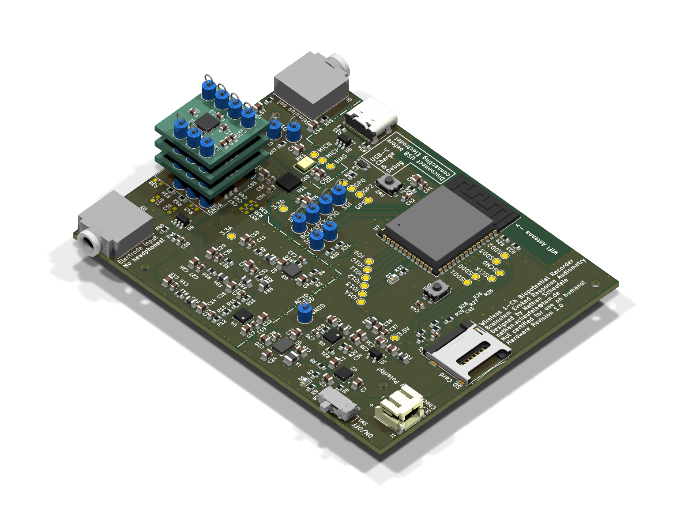

# Wireless BERA

**Wireless Biopotential Electrode Recording Amplifier**

A wireless, battery-powered biopotential recording system for EEG and auditory brainstem response (ABR/BERA) measurements.

> **BERA** stands for two things in this project:
> - **B**rainstem **E**voked **R**esponse **A**udiometry — the clinical application
> - **B**iopotential **E**lectrode **R**ecording **A**mplifier — the hardware

---

## Hardware

**MCU:** ESP32-S3-WROOM-1 — Wi-Fi 802.11 b/g/n + Bluetooth 5.0 LE

**Analog Front-End:**
- LTC6373 programmable-gain instrumentation amplifier (Gain: 0.25, 0.5, 1, 2, 4, 8, 16)
- TAC5212 24-bit ADC via I²S
- Infineon IM73A135 differential MEMS microphone (stimulus/environment monitoring)
- Driven Right Leg (DRL) circuit via OPA376 (active CMR)

**Power** — see [PowerArchitecture.pdf](docs/PowerArchitecture.pdf):

- BQ24074 single-cell Li-Ion charger
- TPS63000 buck-boost → 3.5 V regulated
- TPS65132W dual charge-pump → ±5.5 V raw
- TPS7A39 dual ultra-low-noise LDO → ±5 V (analog section)
- TPS7A94 LDO → 3.3 V analog
- TPS7A2033 LDO → 3.3 V digital
- Star-topology and LC filters on all analog supply rails

**Peripherals:** MicroSD (SDMMC 4-bit), USB-C (USB 2.0 + ESD)

**PCB:** 4-layer, split GNDA/GNDD

### Daughterboard
Optional plug-in for standalone LTC6373 evaluation at fixed Gain = 16. Stacking multiple daughterboards parallels the INA inputs, reducing equivalent input noise by √n.

---

>  **v1.0 — Pre-production prototype. Not yet fabricated.**

## 3D Renderings

### Stacked Assembly (Main Board + 3x Daughterboards)
Three LTC6373 Daughterboards stacked on top of the main Wireless BERA board to parallel the inputs and reduce equivalent input noise by $\sqrt{n}$.

---

## Tools

- **EDA:** KiCad 10
- **Fabrication target:** Aisler (4-layer, HASL)
- **Firmware:** ESP-IDF (ESP32-S3) — see `firmware/`

---

## Author

Nathan Scheufele
